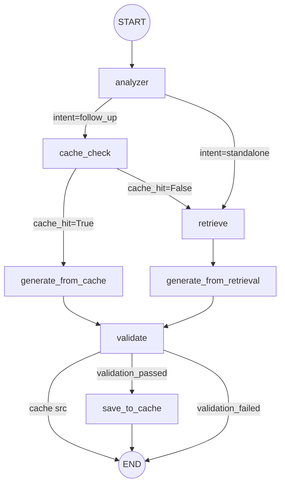

# LangGraph Patterns Skill

## When to Use

Invoke this skill **before writing any LangGraph code**:
- Defining a StateGraph with typed state
- Writing async node functions
- Adding a checkpointer (MemorySaver or SqliteSaver)
- Implementing conditional edges (branching logic)
- Building the RAG-Studio chat graph (analyzer → cache_check → retrieve → generate_from_retrieval → validate → save_to_cache, or analyzer → cache_check → generate_from_cache → validate → END)

---

## 1. Defining a StateGraph with Custom State Schema

```python
from typing import Annotated, Any, TypedDict
from langgraph.graph import StateGraph, END
from langgraph.graph.message import add_messages
from langchain_core.messages import BaseMessage


class RAGState(TypedDict):
    """Custom state for the RAG-Studio chat graph."""
    # Messages (accumulated via add_messages reducer)
    messages: Annotated[list[BaseMessage], add_messages]

    # Query analysis
    query: str
    intent: str  # "follow_up_question" | "standalone_question"

    # Cache
    cache_hit: bool
    cached_answer: str | None

    # Retrieval
    retrieved_docs: list[dict]  # list of {text, score, metadata}
    reranked_docs: list[dict]

    # Generation
    generated_from: str  # "cache" | "retrieval" | ""
    final_answer: str | None

    # Validation
    faithfulness_score: float  # 0.0–1.0, set by validate node
    validation_passed: bool

    # Metadata
    session_id: str
    user_api_key: str | None


# Initialize the graph
graph_builder = StateGraph(RAGState)
```

---

## 2. Writing Async Nodes

### Analyzer Node

```python
from langchain_core.messages import HumanMessage, SystemMessage
from langchain_openai import ChatOpenAI


async def analyzer_node(state: RAGState) -> dict:
    """Classify user intent: 'follow_up_question' or 'standalone_question'.

    A follow-up question is one that references prior conversation context.
    A standalone question is self-contained and needs fresh retrieval.
    """
    llm = ChatOpenAI(model="gpt-4o-mini", temperature=0)

    # System prompt for intent classification
    system_prompt = """You are an intent classifier. Analyze the user's latest message.
Return EXACTLY ONE WORD:
- "follow_up" if the message references prior conversation (e.g., "tell me more", "what about X", "and then?")
- "standalone" if the message is self-contained and does not rely on chat history."""

    messages = [SystemMessage(content=system_prompt)]
    # Include last 3 messages for context
    messages.extend(state["messages"][-3:])

    response = await llm.ainvoke(messages)
    intent = response.content.strip().lower()

    return {
        "query": state["messages"][-1].content if state["messages"] else "",
        "intent": "follow_up_question" if "follow" in intent else "standalone_question",
    }
```

### Cache Check Node

```python
async def cache_check_node(state: RAGState) -> dict:
    """Check if a semantically similar question has a cached answer.

    Uses Qdrant to search for similar cached queries.
    """
    from qdrant_client import AsyncQdrantClient

    client = AsyncQdrantClient(url="http://localhost:6333")

    # Embed the query using the local ONNX model (384-dim, cached in models/)
    # No API key needed — embeddings are 100% local
    query_dense = await get_local_embedding(state["query"])

    # Search the cache collection for similar queries
    results = await client.query_points(
        collection_name="rag_studio_cache",
        query=query_dense,
        limit=1,
        score_threshold=0.92,  # high threshold for cache hits
    )

    if results.points:
        return {
            "cache_hit": True,
            "cached_answer": results.points[0].payload.get("answer"),
        }
    else:
        return {
            "cache_hit": False,
            "cached_answer": None,
        }
```

### Retrieve Node

```python
async def retrieve_node(state: RAGState) -> dict:
    """Perform hybrid search + reranking to retrieve relevant documents."""
    from qdrant_client import AsyncQdrantClient

    client = AsyncQdrantClient(url="http://localhost:6333")

    # Get embeddings using the local ONNX model (384-dim)
    query_dense = await get_local_embedding(state["query"])
    query_sparse = await get_sparse_vector(state["query"])

    # Hybrid search with RRF (from qdrant-operations skill)
    hybrid_results = await hybrid_search(
        client=client,
        query_dense=query_dense,
        query_sparse=query_sparse,
        limit=20,
    )

    # Rerank with cross-encoder
    reranked = await rerank_results(
        query=state["query"],
        candidates=hybrid_results,
        top_k=5,
    )

    retrieved_docs = [
        {
            "text": r["point"].payload.get("text", ""),
            "score": r["rerank_score"],
            "metadata": r["point"].payload.get("metadata", {}),
        }
        for r in reranked
    ]

    return {"retrieved_docs": retrieved_docs}
```

### Generate from Cache Node

```python
async def generate_from_cache_node(state: RAGState) -> dict:
    """Return the cached answer directly — no LLM call needed.

    Formats the cached answer with a cache-source indicator.
    AC-003.2: cache hit path is < 500ms (no LLM call, no retrieval).
    """
    return {
        "final_answer": state["cached_answer"],
        "generated_from": "cache",
    }
```

### Generate from Retrieval Node

```python
from langchain_core.messages import SystemMessage
from langchain_openai import ChatOpenAI


# Hardcoded grounding instruction (AC-006.7) — always first SystemMessage
GROUNDING_INSTRUCTION = (
    "You are RAG-Studio. Answer strictly based on the provided context. "
    "If you don't know, say so."
)


async def generate_from_retrieval_node(state: RAGState) -> dict:
    """Generate the final answer using retrieved documents as context.

    AC-003.5: LLM is prompted to output citations inline as [N].
    AC-006.7: Hardcoded grounding instruction is always the first SystemMessage.
    """
    api_key = state.get("user_api_key")
    llm = ChatOpenAI(
        model="gpt-4o",
        temperature=0.3,
        api_key=api_key,  # from state, never hardcoded
    )

    # Build context from retrieved docs with [N] citation markers
    context_parts: list[str] = []
    for i, doc in enumerate(state["retrieved_docs"]):
        source = doc.get("metadata", {}).get("filename", "unknown")
        context_parts.append(
            f"[DOC {i+1}] (source: {source}): {doc['text']}"
        )
    context = "\n\n---\n\n".join(context_parts)

    system_prompt = f"""{GROUNDING_INSTRUCTION}

When quoting or referencing document content, cite sources inline using [N]
where N is the document number from the context below.

CONTEXT:
{context}"""

    messages: list = [SystemMessage(content=system_prompt)]
    messages.extend(state["messages"])

    response = await llm.ainvoke(messages)

    return {
        "final_answer": response.content,
        "generated_from": "retrieval",
    }
```

### Validate Node (Faithfulness Check)

```python
async def validate_node(state: RAGState) -> dict:
    """Validate that the generated answer is faithful to the retrieved context.

    Uses LLM-as-judge to score faithfulness (0.0–1.0).
    If the answer was generated from cache, validation is skipped
    (faithfulness_score = 1.0, validation_passed = True).

    NFR threshold: faithfulness > 0.7.
    """
    # Cache-generated answers are pre-validated
    if state["generated_from"] == "cache":
        return {"faithfulness_score": 1.0, "validation_passed": True}

    # No retrieved docs → nothing to validate against
    if not state.get("retrieved_docs"):
        return {"faithfulness_score": 0.0, "validation_passed": False}

    api_key = state.get("user_api_key")
    llm = ChatOpenAI(model="gpt-4o-mini", temperature=0, api_key=api_key)

    # Build context for validation
    context = "\n\n".join(
        f"[DOC {i+1}]: {doc['text']}"
        for i, doc in enumerate(state["retrieved_docs"])
    )

    validation_prompt = f"""You are a faithfulness evaluator. Score whether the ANSWER
is fully grounded in the CONTEXT provided. Return ONLY a float between 0.0 and 1.0:
- 1.0: Every claim in the answer is directly supported by the context.
- 0.7–0.9: Minor unsupported details but mostly grounded.
- 0.4–0.6: Partially supported, significant unsupported claims.
- 0.0–0.3: Mostly or entirely unsupported / hallucinated.

ANSWER:
{state["final_answer"]}

CONTEXT:
{context}"""

    response = await llm.ainvoke([HumanMessage(content=validation_prompt)])

    try:
        score = float(str(response.content).strip())
        score = max(0.0, min(1.0, score))  # clamp to [0, 1]
    except ValueError:
        score = 0.5  # default on parse failure

    return {
        "faithfulness_score": score,
        "validation_passed": score > 0.7,  # NFR threshold
    }
```

### Save to Cache Node

```python
import uuid
from datetime import datetime, timezone


CACHE_NAMESPACE = uuid.UUID("6ba7b810-9dad-11d1-80b4-00c04fd430c8")


async def save_to_cache_node(state: RAGState) -> dict:
    """Save newly generated answers to the semantic cache.

    Uses UUID5 deterministic IDs (namespace + normalized query).
    Skips cache-generated answers (already cached).
    Skips when validation fails (don't cache hallucinated answers).
    """
    # Skip if answer was from cache — already stored
    if state["generated_from"] == "cache":
        return {}

    # Skip if validation failed — don't cache hallucinated responses
    if not state.get("validation_passed", False):
        return {}

    from src.vector_store.client import get_qdrant_client

    client = await get_qdrant_client()

    # Generate dense embedding of the QUESTION (same ONNX model)
    from src.ingestion.embedder import get_dense_embedding

    query_dense = await get_dense_embedding(state["query"])

    # UUID5 deterministic ID: same question → same cache key
    point_id = str(
        uuid.uuid5(CACHE_NAMESPACE, state["query"].strip().lower())
    )

    await client.upsert(
        collection_name="rag_studio_cache",
        points=[
            {
                "id": point_id,
                "vector": query_dense,
                "payload": {
                    "query": state["query"],
                    "answer": state["final_answer"],
                    "timestamp": datetime.now(timezone.utc).isoformat(),
                    "session_id": state["session_id"],
                },
            }
        ],
    )

    return {}  # no state changes needed
```

---

## 3. Using a Checkpointer for State Persistence

### Development: MemorySaver (in-memory)

```python
from langgraph.checkpoint.memory import MemorySaver

# Fast, ephemeral — state lost on restart. Use for testing/dev.
memory_checkpointer = MemorySaver()

# Compile the graph WITH the checkpointer
graph = graph_builder.compile(checkpointer=memory_checkpointer)
```

### Production: SqliteSaver (persistent)

```python
from langgraph.checkpoint.sqlite import SqliteSaver

# Persistent — survives container restarts. Use for prod.
# The DB file is stored on a Docker volume (e.g., /data/checkpoints.db).
sqlite_checkpointer = SqliteSaver.from_conn_string("checkpoints.db")

graph = graph_builder.compile(checkpointer=sqlite_checkpointer)
```

### Thread-Level Isolation (Session Separation)

```python
# Each session gets its own thread_id in the checkpointer.
# State from session A never leaks into session B (AC-003.4).

config_session_a = {"configurable": {"thread_id": "session-uuid-a"}}
config_session_b = {"configurable": {"thread_id": "session-uuid-b"}}

# These invocations are fully isolated — separate state, separate history
result_a = await graph.ainvoke(initial_state_a, config_session_a)
result_b = await graph.ainvoke(initial_state_b, config_session_b)
```

### Session Deletion (AC-003.6)

```python
# Deleting a session removes all its checkpointed state from SQLite.
# No orphaned state remains.
async def delete_session(thread_id: str) -> None:
    """Delete a chat session and all its state from the checkpointer."""
    # SqliteSaver stores state keyed by thread_id.
    # Deleting the thread removes all associated checkpoints.
    # Implementation depends on LangGraph version — use the checkpointer's
    # internal aput / delete methods or direct SQLite DELETE.
    ...
```

**Important:** The checkpointer enables:
- State persistence across graph invocations and container restarts.
- Resuming interrupted workflows mid-graph.
- Thread-level isolation (by `thread_id`/`session_id`) — AC-003.4.
- Single source of truth for chat history — no separate JSON files needed.

---

## 4. Conditional Edges (Branching Logic)

```python
def route_after_analyzer(state: RAGState) -> str:
    """Route based on intent: follow-up → cache_check, standalone → retrieve."""
    if state["intent"] == "follow_up_question":
        return "cache_check"
    else:
        return "retrieve"


def route_after_cache_check(state: RAGState) -> str:
    """Route based on cache hit:
    - True → generate_from_cache (skip retrieval + LLM generation, AC-003.2)
    - False → retrieve (run full pipeline)
    """
    if state["cache_hit"]:
        return "generate_from_cache"
    else:
        return "retrieve"


def route_after_validate(state: RAGState) -> str:
    """Route based on validation result and generation source:
    - Cache-sourced → END (already in cache, no need to re-save)
    - Retrieval-sourced + validation passed → save_to_cache
    - Retrieval-sourced + validation failed → END (don't cache bad answers)
    """
    if state["generated_from"] == "cache":
        return "end"
    if state.get("validation_passed", False):
        return "save_to_cache"
    return "end"


# Add conditional edges
graph_builder.add_conditional_edges(
    "analyzer",
    route_after_analyzer,
    {
        "cache_check": "cache_check",
        "retrieve": "retrieve",
    },
)

graph_builder.add_conditional_edges(
    "cache_check",
    route_after_cache_check,
    {
        "generate_from_cache": "generate_from_cache",
        "retrieve": "retrieve",
    },
)

graph_builder.add_conditional_edges(
    "validate",
    route_after_validate,
    {
        "save_to_cache": "save_to_cache",
        "end": END,
    },
)
```

---

## 5. Full Graph Assembly

```python
from langgraph.graph import StateGraph, END

def build_rag_graph() -> StateGraph:
    """Build the complete RAG-Studio chat graph with 7 nodes.

    Nodes: analyzer, cache_check, retrieve, generate_from_cache,
           generate_from_retrieval, validate, save_to_cache.
    """
    builder = StateGraph(RAGState)

    # Add all 7 nodes
    builder.add_node("analyzer", analyzer_node)
    builder.add_node("cache_check", cache_check_node)
    builder.add_node("retrieve", retrieve_node)
    builder.add_node("generate_from_cache", generate_from_cache_node)
    builder.add_node("generate_from_retrieval", generate_from_retrieval_node)
    builder.add_node("validate", validate_node)
    builder.add_node("save_to_cache", save_to_cache_node)

    # Set entry point
    builder.set_entry_point("analyzer")

    # Conditional edges from analyzer
    builder.add_conditional_edges(
        "analyzer",
        route_after_analyzer,
        {"cache_check": "cache_check", "retrieve": "retrieve"},
    )

    # Conditional edges from cache_check
    builder.add_conditional_edges(
        "cache_check",
        route_after_cache_check,
        {"generate_from_cache": "generate_from_cache", "retrieve": "retrieve"},
    )

    # Linear edges: retrieve → generate_from_retrieval
    builder.add_edge("retrieve", "generate_from_retrieval")

    # Both generate nodes → validate
    builder.add_edge("generate_from_cache", "validate")
    builder.add_edge("generate_from_retrieval", "validate")

    # Conditional edges from validate
    builder.add_conditional_edges(
        "validate",
        route_after_validate,
        {"save_to_cache": "save_to_cache", "end": END},
    )

    # save_to_cache → END
    builder.add_edge("save_to_cache", END)

    return builder


# Compile with checkpointer (prod-ready)
graph = build_rag_graph().compile(checkpointer=SqliteSaver.from_conn_string("checkpoints.db"))
```

---

## 6. Invoking the Graph (Async)

```python
from langchain_core.messages import HumanMessage


async def run_rag_graph(
    query: str,
    session_id: str,
    user_api_key: str | None = None,
) -> dict[str, object]:
    """Run the RAG graph for a single query.

    Returns a dict with 'final_answer', 'generated_from',
    'faithfulness_score', and 'retrieved_docs'.
    """
    config = {
        "configurable": {
            "thread_id": session_id,  # isolates state per session (AC-003.4)
        }
    }

    initial_state = {
        "messages": [HumanMessage(content=query)],
        "query": query,
        "intent": "",
        "cache_hit": False,
        "cached_answer": None,
        "retrieved_docs": [],
        "reranked_docs": [],
        "generated_from": "",
        "final_answer": None,
        "faithfulness_score": 0.0,
        "validation_passed": False,
        "session_id": session_id,
        "user_api_key": user_api_key,
    }

    result = await graph.ainvoke(initial_state, config)

    return {
        "final_answer": result.get("final_answer"),
        "generated_from": result.get("generated_from", ""),
        "faithfulness_score": result.get("faithfulness_score", 0.0),
        "retrieved_docs": result.get("retrieved_docs", []),
    }
```

---

## 7. Graph Visualization (Mermaid)



**Flow summary:**

```
Cache HIT path (AC-003.2, < 500ms):
  START → analyzer → cache_check → generate_from_cache → validate → END

Cache MISS path (AC-003.3, < 3s p95):
  START → analyzer → cache_check → retrieve → generate_from_retrieval → validate → save_to_cache → END

Standalone path (no cache check):
  START → analyzer → retrieve → generate_from_retrieval → validate → save_to_cache → END
```

---

## Best Practices

1. **Always use async nodes** (`async def`) for I/O-bound operations (embeddings, Qdrant, LLM calls).
2. **Use TypedDict with Annotated reducers** for state that accumulates (e.g., `messages: Annotated[list, add_messages]`).
3. **Set `thread_id` in config** for session-level state isolation (AC-003.4).
4. **Use conditional edges** (not linear edges with if/else inside nodes) for branching — this keeps the graph topology explicit and enables LangSmith tracing of each path.
5. **Keep nodes focused** — each node does ONE thing (SRP):
   - `analyzer` → intent classification only.
   - `cache_check` → cosine similarity lookup only.
   - `retrieve` → hybrid search + rerank only.
   - `generate_from_cache` → format cached answer only (no LLM).
   - `generate_from_retrieval` → LLM generation with citations only.
   - `validate` → faithfulness scoring only.
   - `save_to_cache` → cache persistence only (skip if cache-sourced or invalid).
6. **Split generate nodes by source**: `generate_from_cache` (fast, no LLM) vs `generate_from_retrieval` (LLM with context) — this enables the <500ms cache-hit path (AC-003.2).
7. **Always validate after generation**: the `validate` node gates `save_to_cache` — hallucinated answers are never cached.
8. **Use MemorySaver for dev, SqliteSaver for prod** — the checkpointer interface is the same.
9. **Never hardcode API keys** in graph nodes — pass them via state or config.
